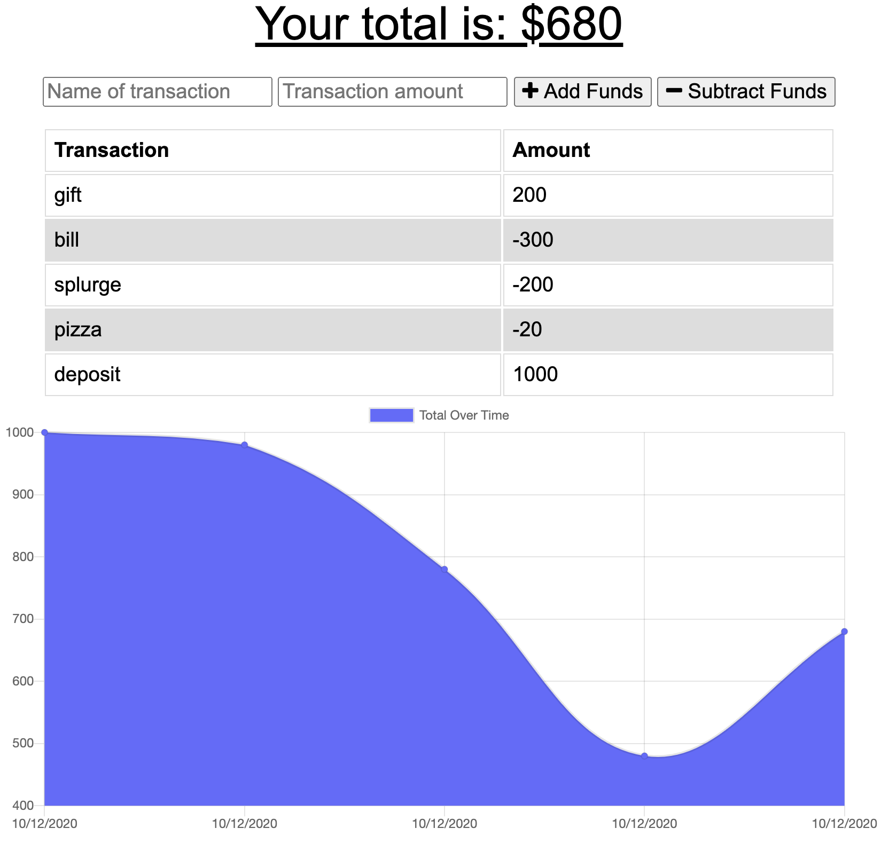

# Budget Tracker

# Description
This is an application created to create a readme.md file through the use of the CLI interface. 

# Technologies
* JS
* Node.js
* MongoDB
* Mongoose
* Progressive Web Applications
* Offline Use

# Links
[Repository: https://github.com/layc41/budget-tracker](https://github.com/layc41/budget-tracker)

[Deployed Site: https://fast-reaches-45754.herokuapp.com/](https://fast-reaches-45754.herokuapp.com/)

# Screenshot

# Contributing
Developers may add more questions to the application or add more features to add more details to their project’s readme.md.

# Tests
N/A.

# Questions
* [GitHub](https://github.com/layc41)
* Email: claudialay41@gmail.com
